# AI-Based Research Paper Analysis and Journal Management System

## Project Overview

The AI-Based Research Paper Analysis and Journal Management System is a web application developed using PHP, MySQL, Python, Bootstrap 5, Hugging Face Transformers, and KeyBERT.

The system allows authors to upload research papers, automatically generates AI summaries and keywords, supports peer review by reviewers, enables editors to publish or reject papers, and provides an admin dashboard for complete journal management.

---

## Technologies Used

- PHP
- MySQL
- Bootstrap 5
- Python
- Hugging Face Transformers
- KeyBERT
- PyMuPDF
- HTML
- CSS
- JavaScript

---

## Modules

### Author Module

- Author Registration
- Author Login
- Upload Research Paper
- View My Papers
- View AI Analysis

### Reviewer Module

- Reviewer Login
- Review Assigned Papers
- Rating
- Comments
- Recommendation

### Editor Module

- Editor Login
- View Reviews
- Publish Paper
- Reject Paper

### Admin Module

- Admin Login
- Dashboard
- Manage Papers
- View AI Reports

---

## AI Features

- Automatic Research Paper Summary
- Keyword Extraction
- Reading Time Estimation
- AI Score
- Predicted Research Domain

---

## Software Requirements

- XAMPP
- PHP 8+
- MySQL
- Python 3.12
- Visual Studio Code

---

## Python Libraries

```bash
pip install pymupdf transformers keybert sentence-transformers pymysql torch
```

---

## Installation

1. Install XAMPP
2. Copy the project into the htdocs folder.
3. Create the ai_journal_db database.
4. Import the SQL file.
5. Install the required Python libraries.
6. Start Apache and MySQL.
7. Open:

```
http://localhost/AI_Journal_System
```

---

## Developed By

**Mohammed Asim**

Kakatiya Institute of Technology and Science (KITSW)

Warangal, Telangana

---

## License

This project is developed for educational purposes.

---
## ## Project Screenshots

### 🏠 Home Page

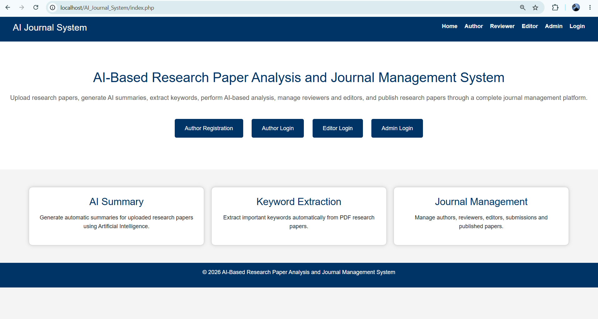

### 🔐 Author Login

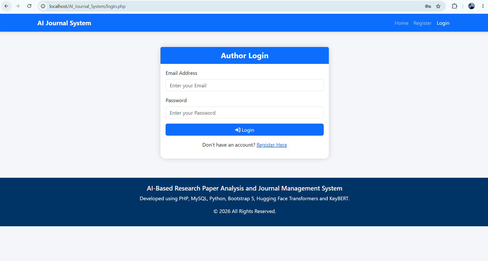

### 📊 Author Dashboard

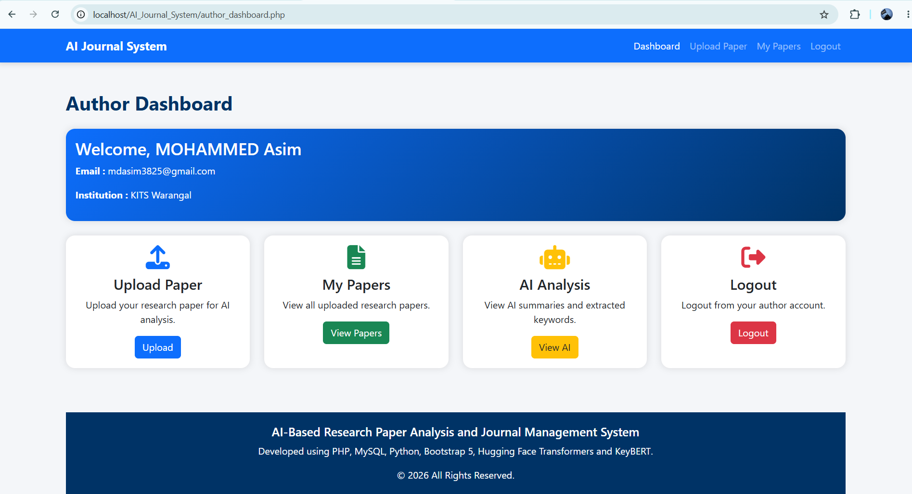

### 📤 Upload Research Paper

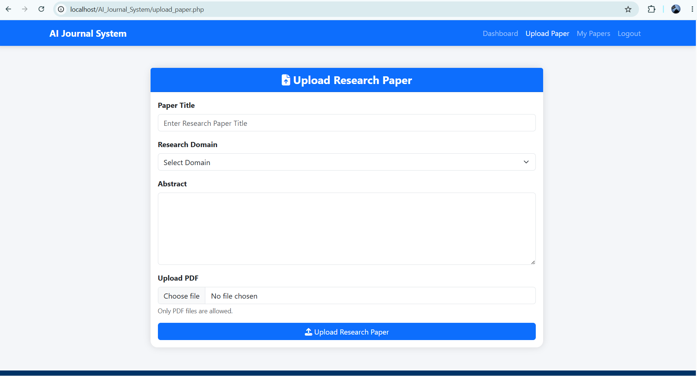

### 📄 My Papers

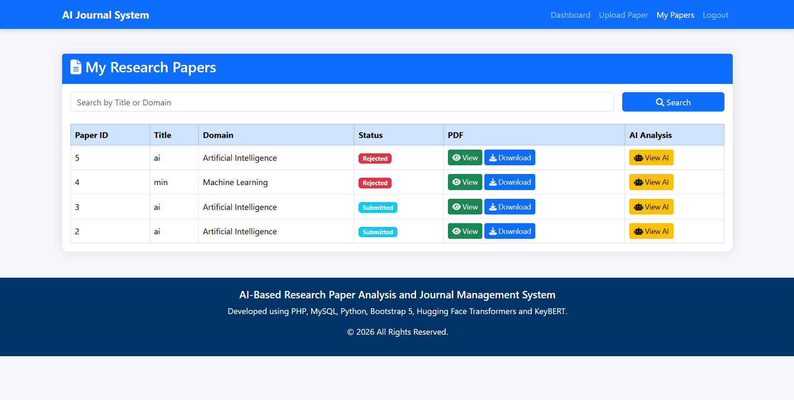

### 🤖 AI Analysis

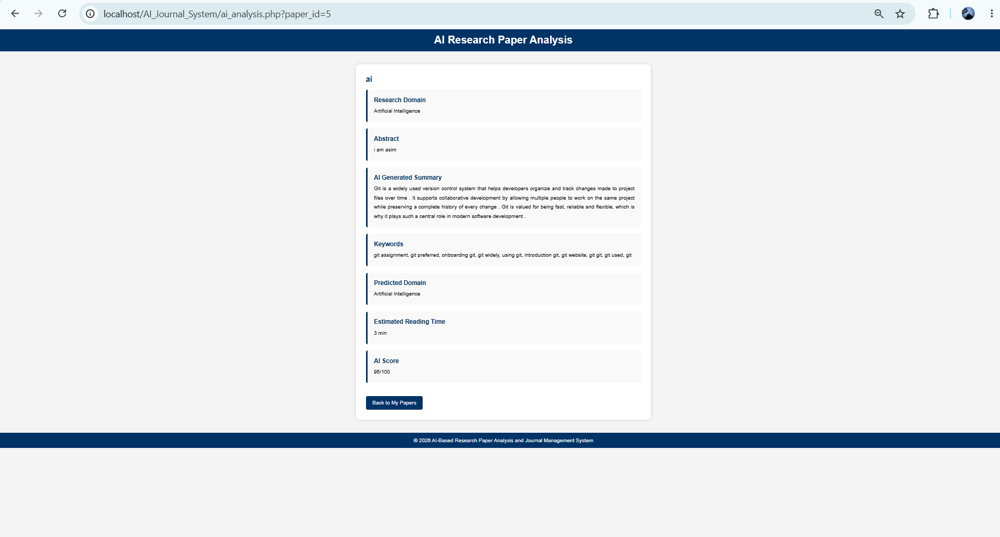

### 👨‍⚖️ Reviewer Login

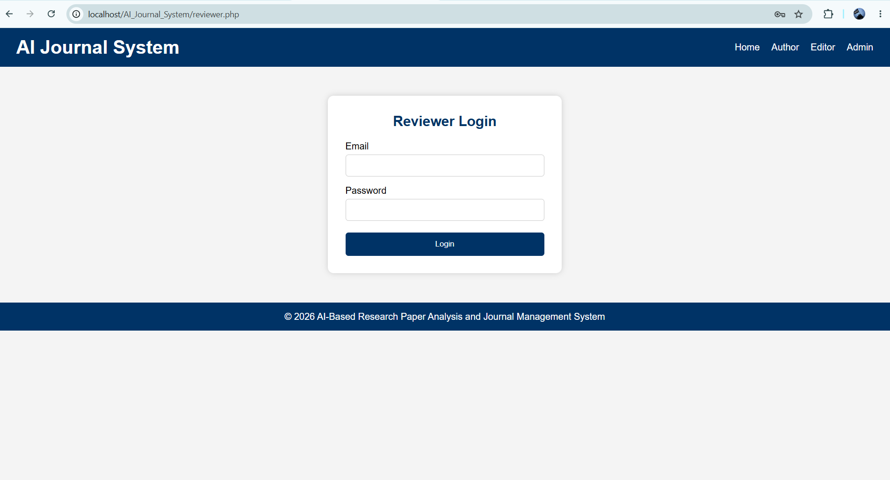

### 📋 Reviewer Dashboard

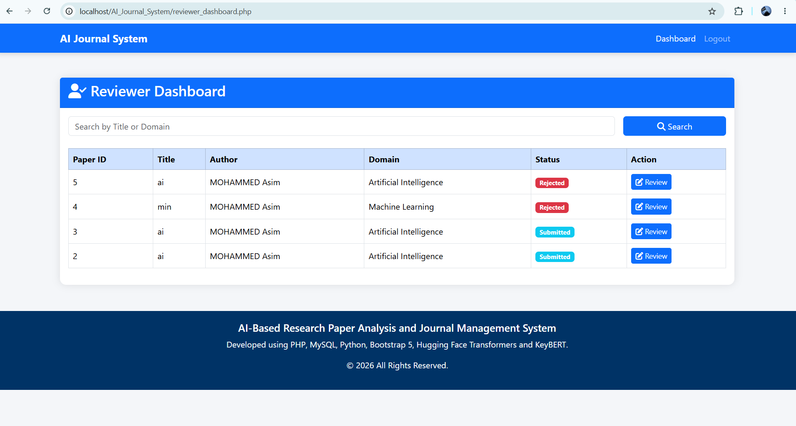

### 📝 Review Paper

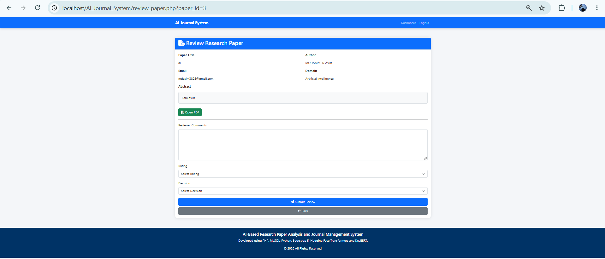

### 👨‍💼 Editor Login

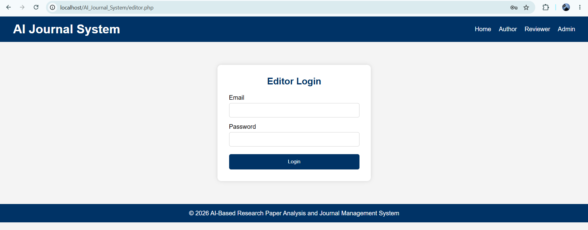

### 📊 Editor Dashboard

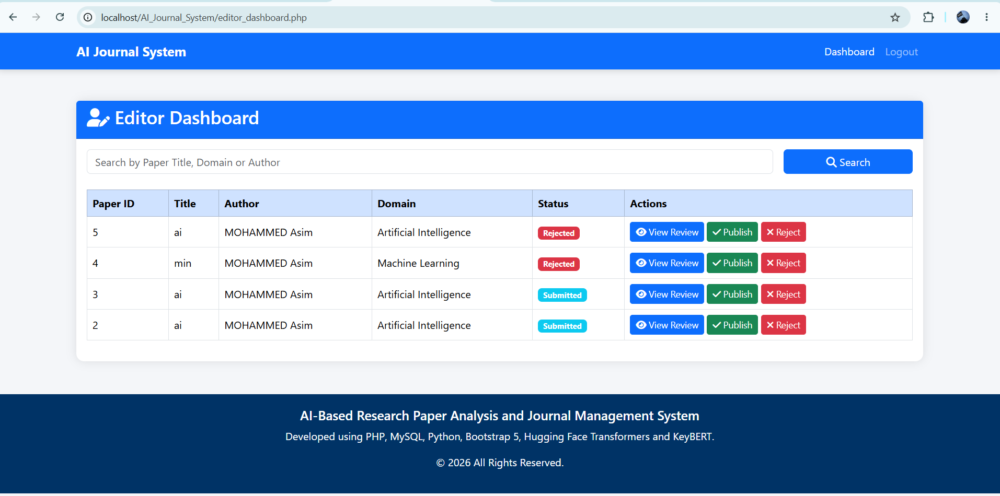

### ✅ Editor Review

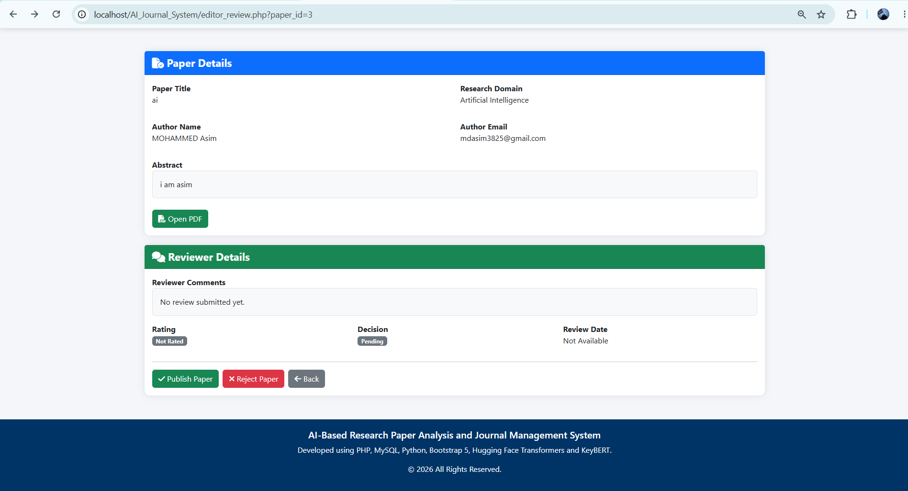

### 👨‍💻 Admin Login

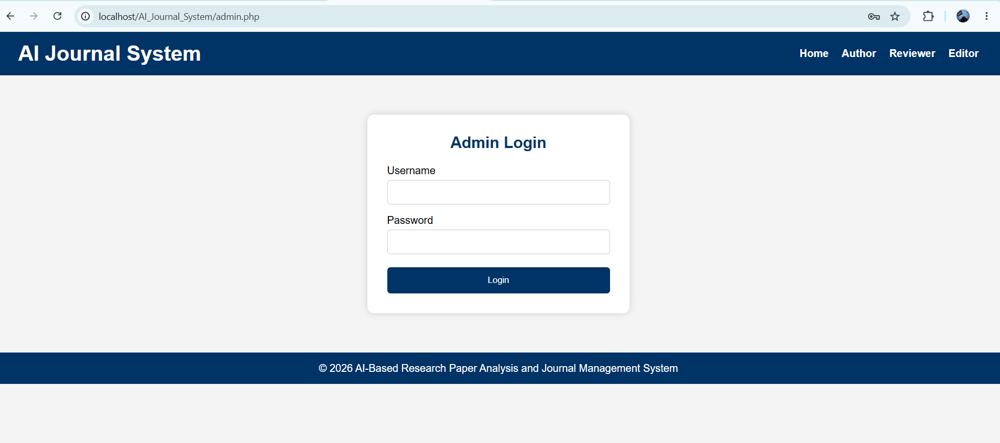

### 📈 Admin Dashboard

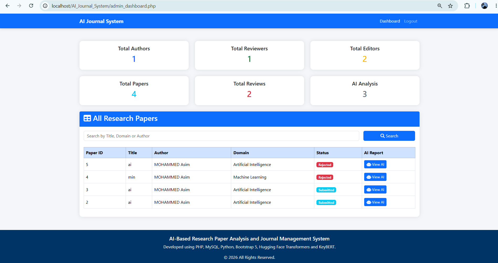

### 👤 Author Registration

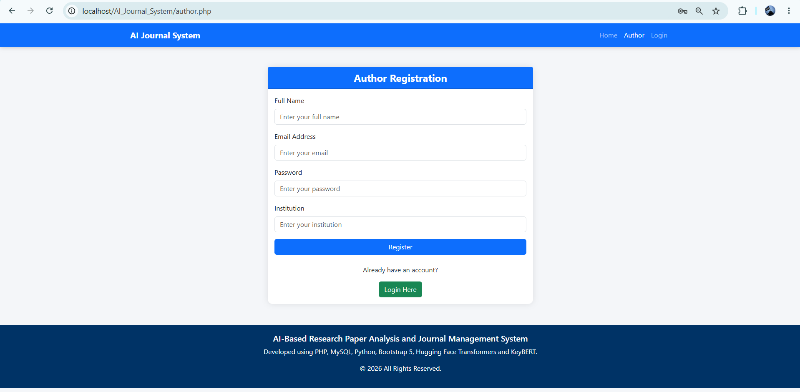
